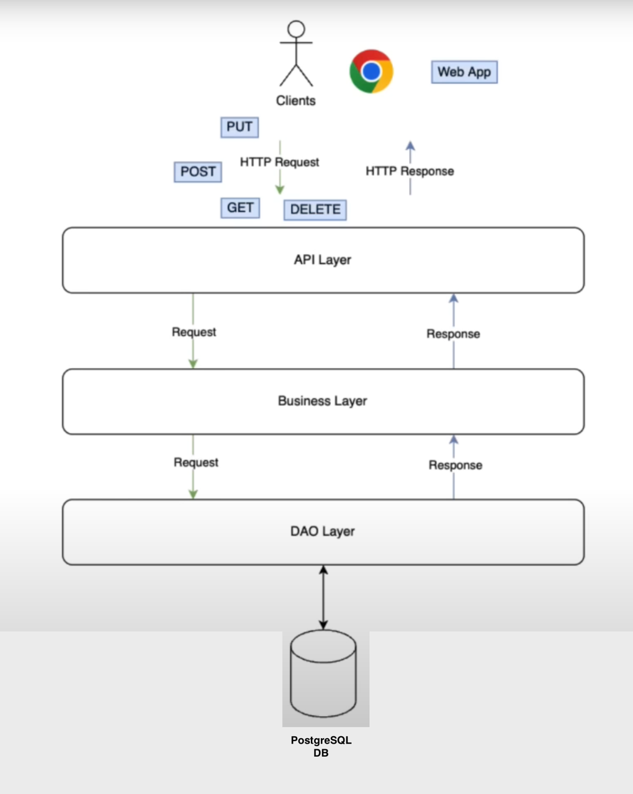
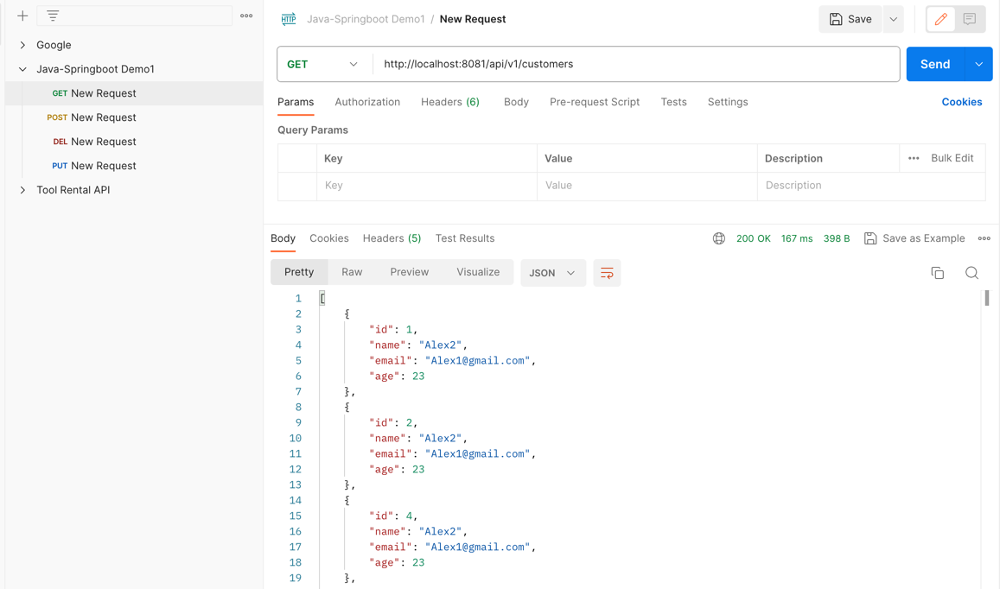
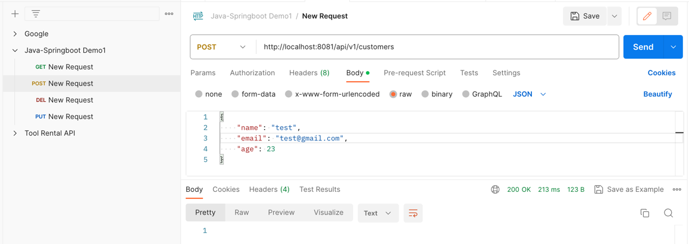
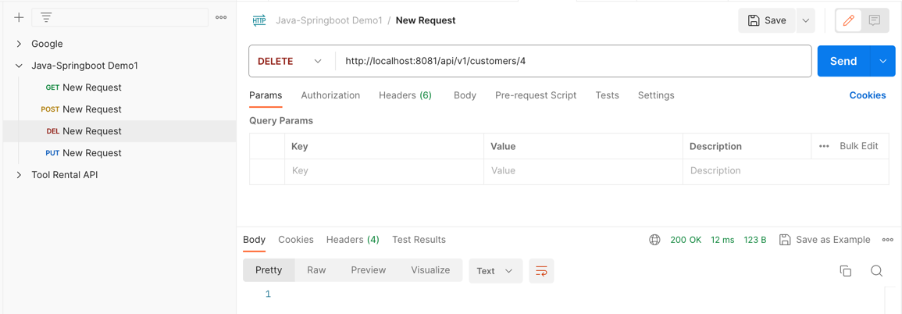
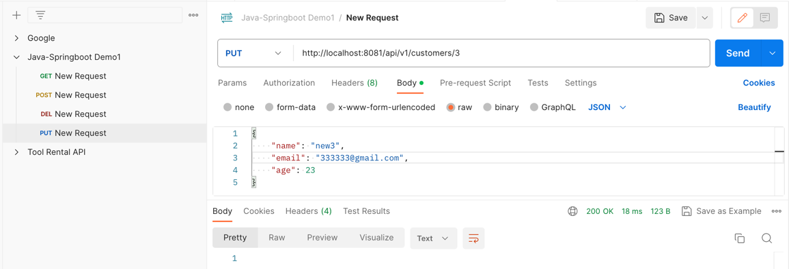

# java-springboot3-demo

#### Simple RESTapi app to demonstrate CRUD operations using Java Springboot3, PostgreSQL and Docker



#### Make sure DockerCompose is up and setting below on PostgreSQL container
```
   docker exec -it postgres sh
   psql -U user
   CREATE DATABASE customer;
```




