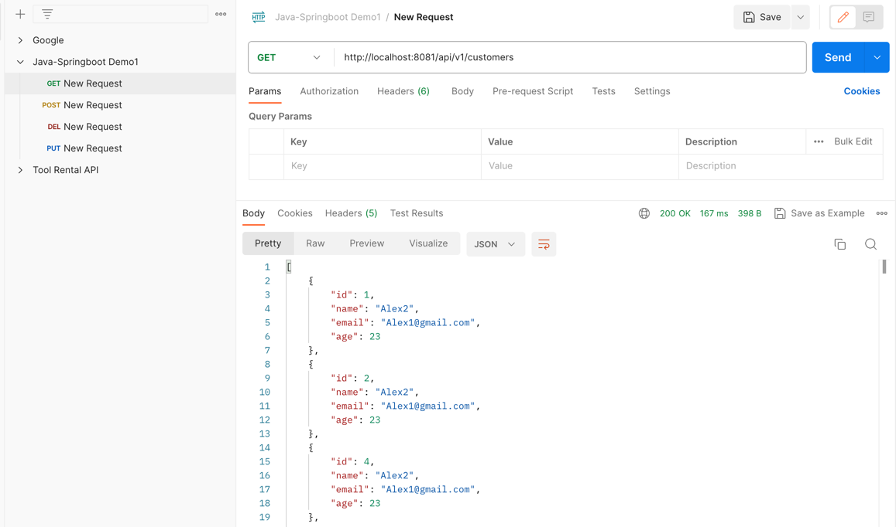

# java-springboot3-demo

#### Simple RESTapi app to demonstrate CRUD operations using Java Springboot3, PostgreSQL and Docker


#### Make sure DockerCompose is up and setting below on PostgreSQL container
```
   docker exec -it postgres sh
   psql -U user
   CREATE DATABASE customer;
```


#### Then we can perform CRUD Operations (GET,POST,PUT,DEl) using Postman





